

    Vous avez envie d’introduire un peu plus d’écriture dans le quotidien de votre enfant (et le vôtre 😉) ? Voici une
    façon de le faire et que j’ai moi-même introduite dans ma maisonnée. Il s’agit de la boite aux lettres! On se
    bricole une belle boite aux lettres que l’on peut ensuite accrocher près de sa porte de chambre. Et papa et maman
    aussi peuvent en avoir une! C’est même encouragé pour établir une correspondance écrite dans la vie familiale. Les
    enfants peuvent donc écrire des lettres et aller les placer dans la boite aux lettres du destinataire.

Voici comment j’ai fabriqué ma boite :

    
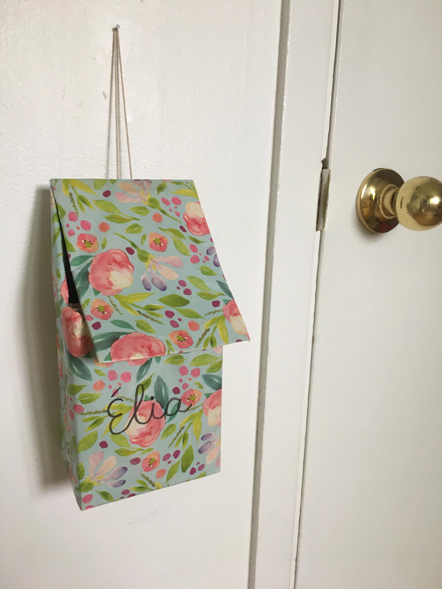

    

        <h2 className="md:px-10 pt-4 font-mulish font-semibold">Matériel :</h2>
        

            <ul className="list-disc list-outside pl-6">
                <li className="sm:pl-2">Boite de mouchoirs vide ;</li>
                <li className="sm:pl-2">Papier d’emballage au choix (pour décorer) ;</li>
                <li className="sm:pl-2">2 cartons rigides (largeur de la boite) ;</li>
                <li className="sm:pl-2">Corde ;</li>
                <li className="sm:pl-2">Velcro (facultatif) ;</li>
                <li className="sm:pl-2">Ciseaux ;</li>
                <li className="sm:pl-2">Papier collant ;</li>
                <li className="sm:pl-2">Crayon</li>
            </ul>
        

    

<h2 className="md:px-10 pt-4 font-mulish font-semibold">Comment faire :</h2>

    <ol className="list-decimal list-outside pl-6 space-y-8">
        <li className="sm:pl-2">
            Placer la boite de mouchoirs devant soi, à la verticale. Au tiers de la boite à partir du haut, venir tracer
            une ligne horizontale. Poursuivre cette ligne sur les côtés de la boite en diagonale pour rejoindre les
            sommets qui pointent vers l’extérieur.{' '}
            

                
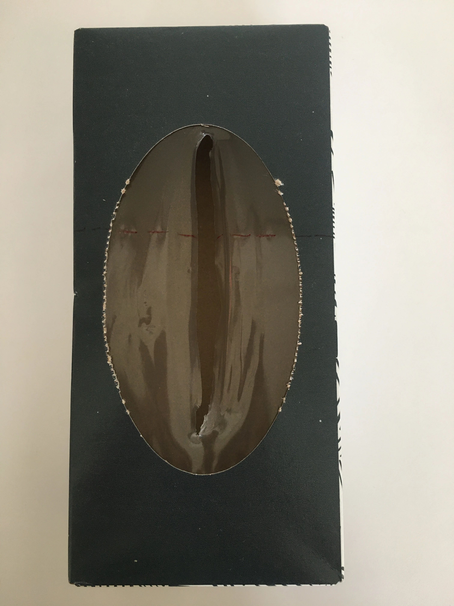

                
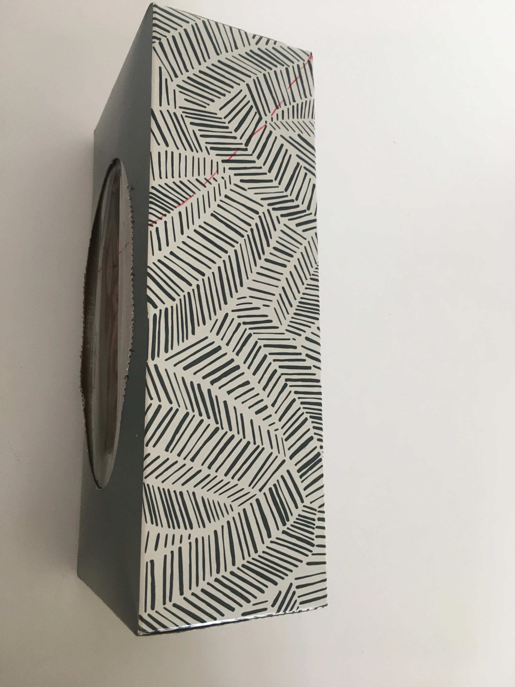

            

        </li>
        <li className="sm:pl-2">
            Découper en suivant toute la ligne tracée. Ça devrait ressembler à ça :
            

                
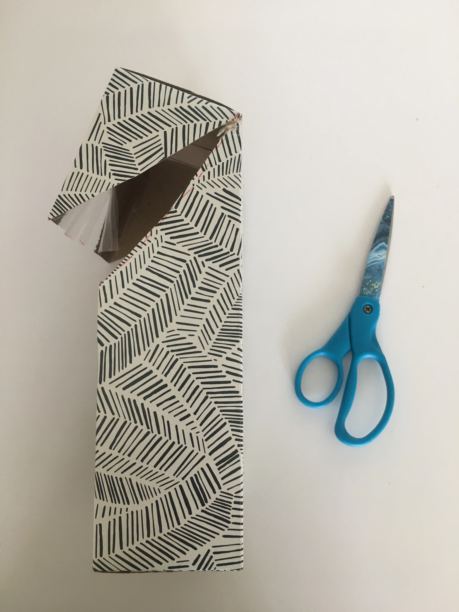

                
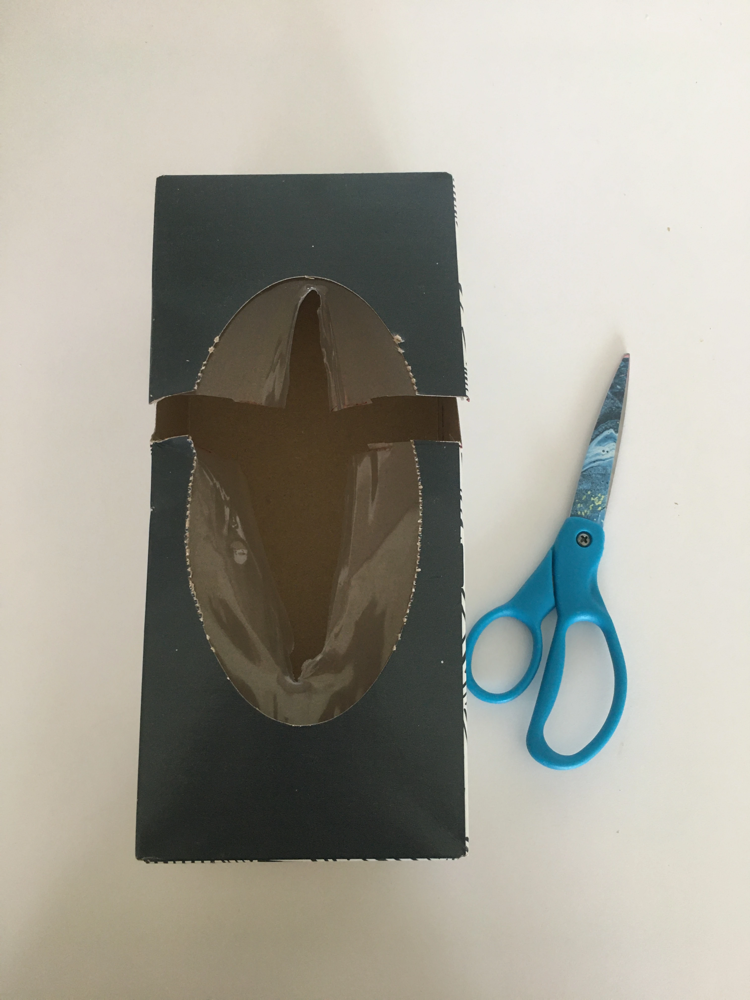

            

        </li>
        <li className="sm:pl-2">
            

                

                    

                        Ouvrir le dessus de la boite pour retirer les 2 triangles sur les côtés avec les ciseaux. Ici
                        :{' '}
                    

                    
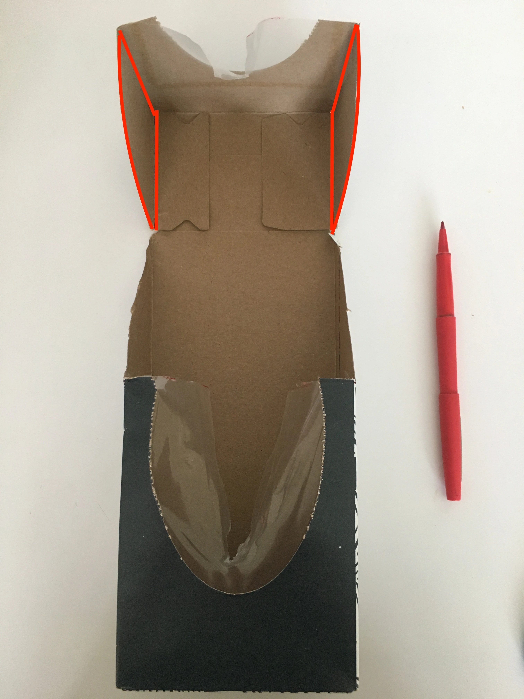

                

                

                    
Ce qui donne ceci : 

                    
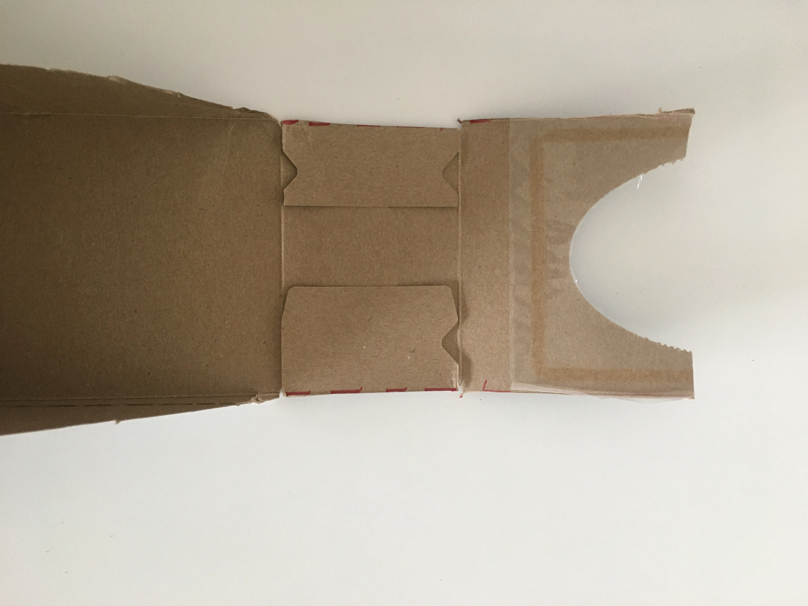

                    
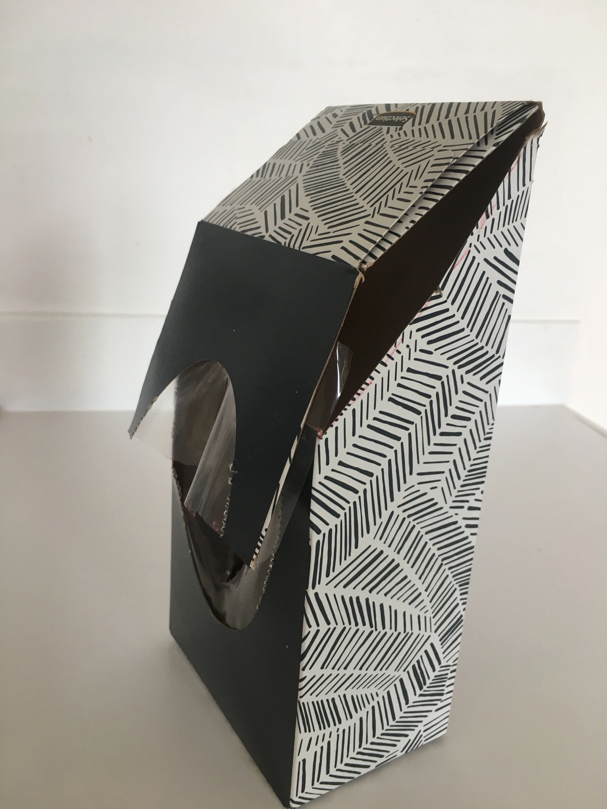

                    
Forme finale de la boite aux lettres

                

            

        </li>
        <li className="sm:pl-2">
            

                

                    Coller un carton rigide (qui respecte les mesures de la boite) sur la partie supérieure du devant de
                    la boite (celle qui se relève), à l’intérieur de la boite pour solidifier :
                

                
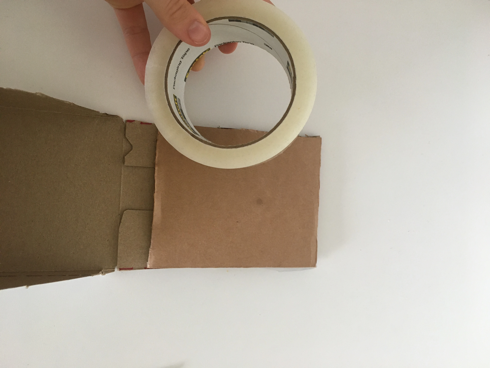

            

        </li>
        <li className="sm:pl-2">
            

                
Répéter l’étape 4 pour la partie inférieure du devant.

                
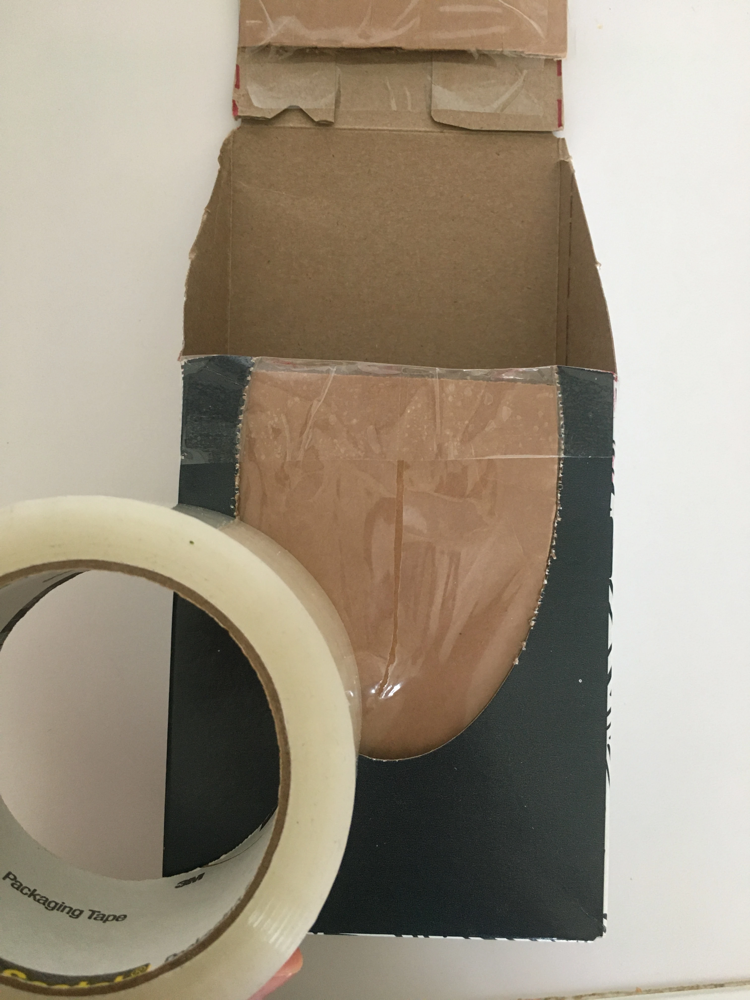

            

        </li>
        <li className="sm:pl-2">Décorer la boite en l’emballant avec du papier d’emballage.</li>
        <li className="sm:pl-2">
            

                
Coller la corde derrière la boite pour pouvoir l’accrocher au mur.

                
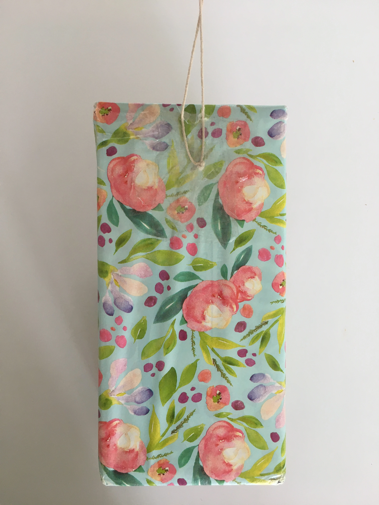

            

        </li>
        <li className="sm:pl-2">
            

                
Facultatif : coller du velcro pour bien maintenir fermée la boite aux lettres

                
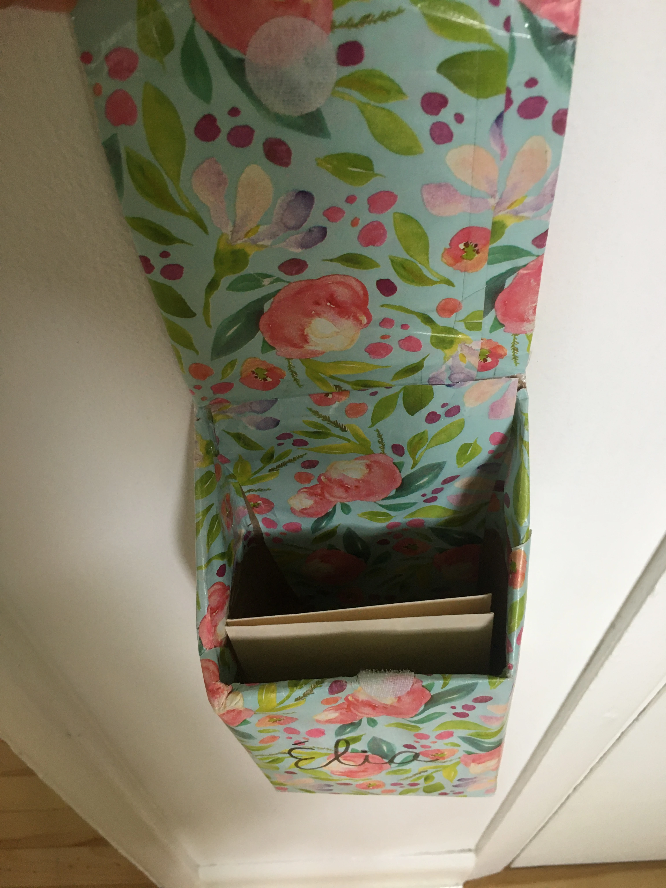

            

        </li>
    </ol>

Vous pouvez trouver ce DIY en vidéo (reel) sur ma page Instagram @laurencebf.orthopédagogue.
