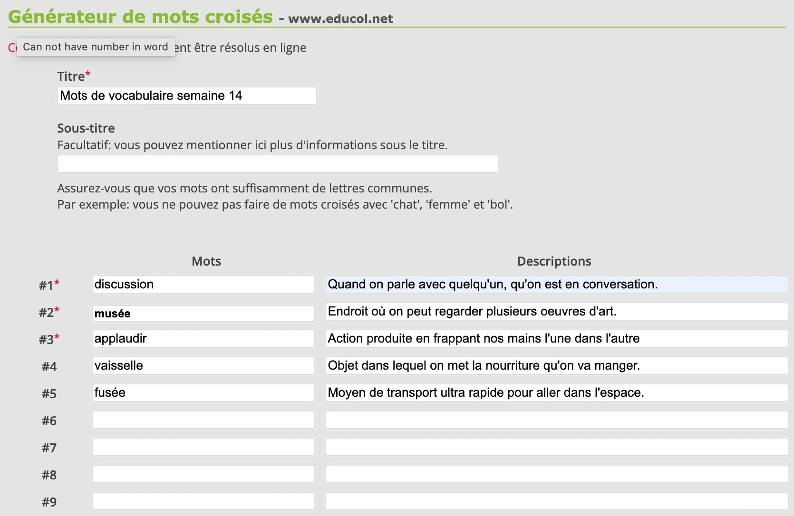
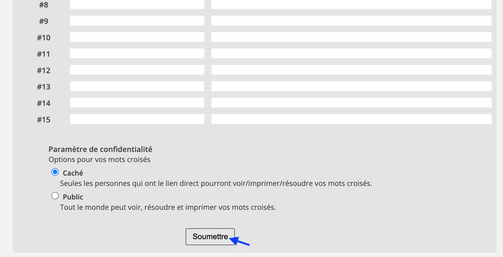
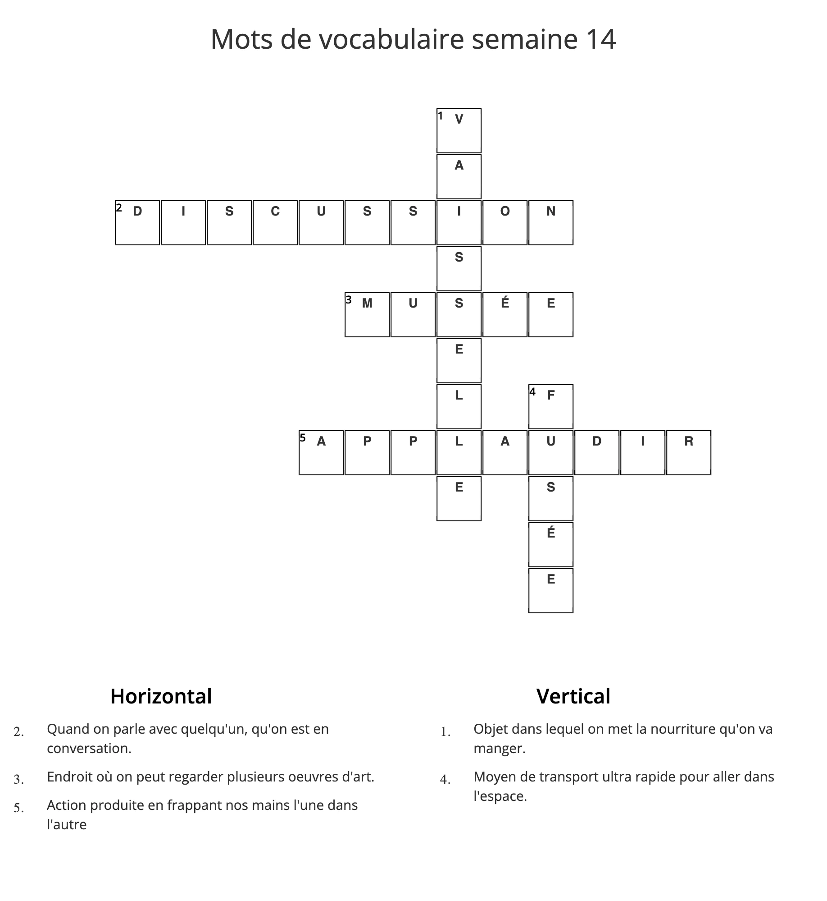
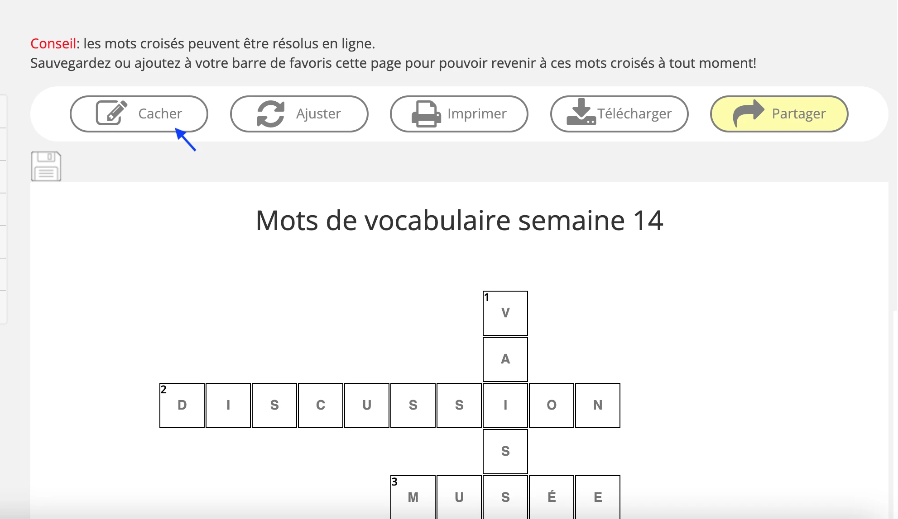
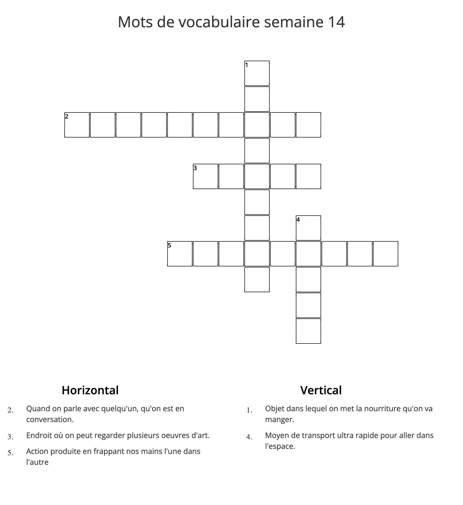

L’étude des mots de vocabulaire est bien souvent un incontournable pour les enfants du primaire.

Si une étude réfléchie et analytique est efficace et encouragée, il est aussi tout à fait possible d’intégrer des petits jeux éducatifs et efficaces à votre routine de leçons. La création de mots croisés est une façon ludique de travailler sur le sens et l’appropriation des mots.

Et travailler le sens des mots de vocabulaire, c’est important! Même très important!

Une équipe de chercheurs québécois a pu démontrer l’impact positif du travail sur le sens des mots à l’étude dans l'apprentissage de l’orthographe (Berthiaume, Anctil, & Daigle, 2020). Voici un extrait d’un article publié à ce sujet :

« Or, notre recherche a démontré qu’en bénéficiant d’un enseignement explicite pluridimensionnel abordant à la fois la forme, le sens et l’utilisation des mots ciblés, les élèves en ont non seulement acquis une connaissance plus profonde, mais ont aussi amélioré leur maitrise orthographique de façon plus importante qu’à travers une approche traditionnelle pourtant orientée résolument vers la dimension orthographique » (Berthiaume, Anctil, & Daigle, 2020).

Ainsi, trois dimensions peuvent être travaillées lors de l’étude des mots de vocabulaire : la forme (e muet, préfixe « re », mots de même famille, etc.), le sens (synonymes, définition) et l’utilisation (registre de langue, la syntaxe) (Berthiaume, Anctil, & Daigle, 2020 ; Nation, 2001). Toucher à toutes ces dimensions lors de l’étude des mots de vocabulaire permet aux enfants de mieux retenir l’orthographe. C’est déjà super pour la dictée du vendredi, mais il y a plus! Les enfants se souviendront mieux des mots étudiés de cette façon dans le futur : l’apprentissage reste! Et travailler le sens des mots permet aux enfants d'acquérir plus de vocabulaire, ce qui les aide dans leur développement oral, mais aussi dans leur développement de leur compétence en lecture : quand on comprend plus de mots, on rencontre moins de mots inconnus dans un texte, ce qui en facilite sa compréhension.

Bref, le jeu des mots croisés permet assurément de travailler plus spécifiquement la dimension du sens, ce qui est extrêmement bénéfique pour votre enfant, et ce, dans plusieurs sphères du développement langagier.

Sans plus attendre, voici comment intégrer les mots croisés à l’étude des mots de vocabulaire :

Avec votre enfant, vous pouvez créer des mots croisés sur le site suivant (<a href="https://www.educol.net/crosswordgenerator.php" className="underline text-blue-500 break-words">https://www.educol.net/crosswordgenerator.php</a>).

En plus de devoir écrire les mots correctement, votre enfant doit connaitre la signification des mots pour pouvoir donner un indice sur le mot à deviner. Il doit donc réfléchir au sens avant d’écrire sa définition maison (dans ses mots). Dans le générateur, il doit écrire le mot de vocabulaire à faire deviner accompagné de sa définition maison. Il recommence jusqu’à ce que tous ses mots et leurs définitions soient inscrits dans le générateur.

Lorsque toutes les définitions et tous les mots sont inscrits dans le générateur, vous obtenez le corrigé.

Pour obtenir la grille vierge, vous devez cliquer sur le bouton « cacher ». Vous pouvez alors imprimer votre grille ou la remplir directement sur le site.

Le soutien que vous pouvez apporter à votre enfant varie en fonction de votre enfant et en fonction de son âge. Un enfant plus vieux est capable de compléter cette tâche de façon relativement autonome alors qu’un plus jeune aura besoin d’un peu plus d’aide, ne serait-ce que sur la notion de définition, mais aussi en lien avec les compétences technologiques nécessaires à l’utilisation du générateur.

Et après, qui remplit la grille des mots croisés?

C’est libre à vous (et à votre enfant)! Si les mots croisés sont créés au début de la semaine, votre enfant pourrait le résoudre à la fin de la semaine. Ça peut servir d’une bonne révision. Sinon, il peut donner son jeu à une personne de son choix : un parent, des ami(e)s, un frère, une soeur, des grands-parents, etc. L’important (excepté l’étude des mots de vocabulaire, bien sûr), c’est que quelqu’un le remplisse pour vrai ; ça ajoute une certaine valeur au travail de votre enfant. En réfléchissant à ses définitions, il sait qu’elles devront être très claires, car elles seront utilisées pour vrai. Le but de l’activité est plus réel pour l’enfant. Et c’est bien plus motivant!
