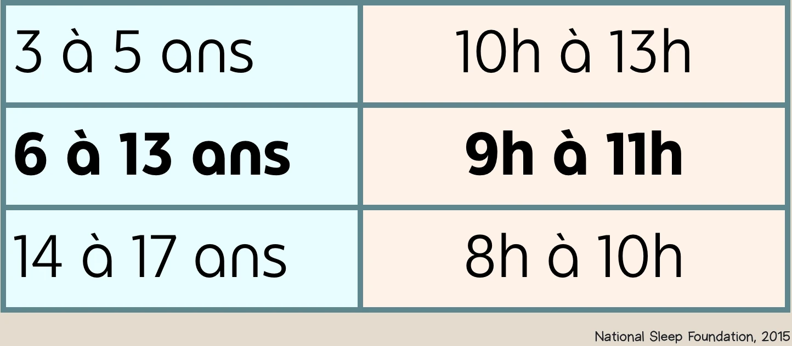

import guide from './Guide de la rentrée.pdf';

Eh oui! L’été tire déjà à sa fin, ce qui signifie que la rentrée scolaire est à nos portes! De mon côté, c’est le temps de l’année où j’ai envie de me créer des bonnes habitudes, de me créer des codes de couleurs et de remplir mon agenda afin d’être le plus organisée possible. Même quand j’étais plus jeune et que je n’avais aucune bonne raison d’avoir un agenda, j’avais un agenda (hihi).

Alors, en tant qu’orthopédagogue, c’est bien évident que j’ai des petits trucs d’organisation et de préparation à la rentrée scolaire à vous proposer. Je vous présente donc mon petit guide de la rentrée (que vous pouvez télécharger au bas de la page).
Dans ce guide, vous retrouverez des trucs d’organisation et des idées pour se remettre tranquillement dans le bain de l’école, ce qui peut faciliter la transition vacances d’été - routine scolaire pour votre enfant (et pour vous 😉)

<h2 className="font-mulish font-bold text-xl ml-4 mt-12">Trucs d'organisation</h2>

    

        

            

                

                    
                

                <label className="ml-8">
                    Sortir le matériel scolaire de l’an passé et cocher le matériel qu’on a déjà sur la liste de cette année. 
                </label>
                

                    
                

            

            
Des affaires de moins à acheter, yes!

        

        
        

            

                    
                

            <label className="ml-8">
                Magasiner le matériel scolaire manquant (ne pas oublier les boites à lunch!)
            </label>
        

        

            

                    
                

            <label className="ml-8">
            Préparer l’étui à crayons : déballer les crayons (et en aiguiser quelques-uns s’ils ne le sont pas déjà), l’efface, le taille-crayon, les surligneurs…
            </label>
        

        

            

                    
                

            <label className="ml-8">
            Étiqueter le nom de l’enfant sur le matériel (si vous êtes motivés, vous pouvez le faire pour chaque crayon, mais sinon, prioriser le matériel plus couteux et le plus indispensable pour votre enfant. ex.: le taille-crayon et l’efface).
            </label>
        

        

            

                

                    
                

                <label className="ml-8">
                Ranger directement le matériel dans les sacs d’école.
                </label>
                

                    
                

                

                    
                

            

            
Et ne plus y toucher! On ne voudrait pas perdre l’efface avant même le début de l’année!

        

        
        

            

                

                    
                

                <label className="ml-8">
                (Essayer de) Reprendre une routine du soir qui favorise une heure de coucher adaptée à l’âge de votre enfant.
                </label>
                

                    
                

            

            

                Voici les recommandations du nombre d’heures de sommeil selon le groupe d’âge
                
            

        

        

            

                
            

            <label className="ml-8">
            Inscrire à l’agenda les dates importantes à partir du calendrier scolaire qui se trouvent sur le site internet de l’école de votre enfant (rentrée scolaire, rencontres, visite de l’école, journées pédagogiques et autres congés).
            </label>
        

        

            

                
            

            <label className="ml-8">
            Planifier les lunchs et les collations (rappel : dans la plupart des écoles, les collations ne peuvent pas être autre chose qu’un fruit (et compote), un légume, un fromage ou un yogourt).
            </label>
        

        

            

                

                    
                

                <label className="ml-8">
                Facultatif : écrire un petit mot à placer dans le sac ou la boite à lunch de votre enfant.
                </label>
                

                    
                

            

            
Même si votre enfant reste à la même école que l’année passée, la rentrée peut être un moment stressant rempli de nouveautés. Un petit mot de maman et papa, c’est toujours rassurant, peu importe l’âge ❤️.

        

    

<h2 className="font-mulish font-bold text-xl ml-4 mt-12">Trucs éducatifs</h2>

    

        

            

                

                    
                

                <label className="ml-8">
                Reprendre une routine de lecture : aller à la bibliothèque ou à la librairie.
                </label>
                

                    
                

            

            
Invitez votre enfant à choisir un livre qui lui plait!

        

        
        

            

                

                    
                

                <label className="ml-8">
                Encourager mon enfant à écrire à la main. Ex.: Demander l’aide de votre enfant pour écrire la liste d’épicerie ; inventer des acrostiches ; écrire une lettre aux grands-parents ; créer une affiche pour le spectacle de danse que votre enfant vous fera dans le salon ce soir ; etc. 
                </label>
               

                    
                

            

            
Quand on n’écrit pas pendant un certain temps, on perd un peu notre calligraphie et notre rapidité. Ça permet aussi de retravailler un peu la réflexion orthographique.

        

        
        

            

                

                    
                

                <label className="ml-8">
                Si mon enfant a droit à une aide technologique en classe (ordinateur), trouver des prétextes pour l'encourager à taper au clavier.
                </label>
                

                    
                

            

            

                Cela lui permettra de se  familiariser à nouveau avec l’emplacement des touches et des raccourcis.
            

        

        

            

                
            

            <label className="ml-8">
            Sortir les jeux de société éducatifs et jouer en famille. Exemples : la classe de 5e, Cat Crimes, les jeux de chez Placote, Chocologique, Tabou, La fabrique à sucre, les Mont-à-mots, etc
            </label>
        

    

Voici la version PDF que vous pouvez télécharger et garder précieusement : <a href={guide} download className="underline text-blue-500">Guide de la rentrée</a>{` `}

Source :

    Hirshkowitz, M., Whiton, K., Albert, S. M., Alessi, C., Bruni, O., DonCarlos, L., ... & Hillard, P. J. A. (2015).
    National Sleep Foundation’s sleep time duration recommendations: methodology and results summary. Sleep health,
    1(1), 40-43.

